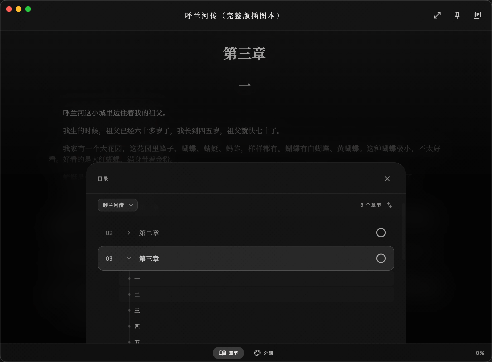
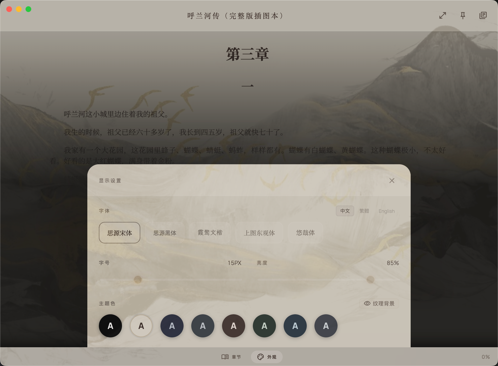
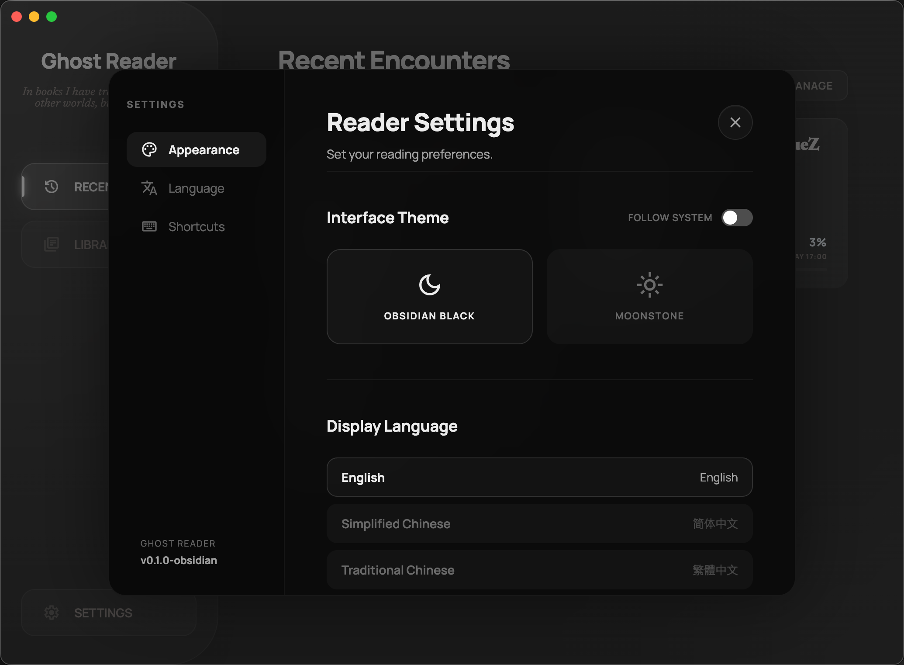

# Ghost Reader 👻

> A ghostly reading companion for TXT and EPUB books.

## ✨ 功能特色

- 📖 支持 TXT 和 EPUB 两种格式
- 🎨 8 款阅读主题 + 深浅色切换 + 主题背景纹理
- 📚 书架管理 —— 最近阅读 + 书库双视图 + 搜索过滤
- 📥 拖放导入 TXT / EPUB 文件
- 🎓 首次阅读新手引导
- 🔖 自动保存阅读进度（TXT 滚动位置 / EPUB 精确书签）
- 🗂 EPUB 章节目录导航
- 🖥 沉浸式全屏阅读模式
- ⌨️ 键盘快捷键（滚行、翻章、沉浸模式等）
- 🔤 字体选择器 + 字号、行高调节
- 🌐 多语言支持（English / 简体中文 / 繁體中文）

## 📸 截图

| 最近阅读 | 书库 |
|:---:|:---:|
|  |  |

| EPUB 阅读 + 目录导航 | 阅读器外观设置 |
|:---:|:---:|
|  |  |

| 最近管理 | 设置面板 |
|:---:|:---:|
| |  |

## 📦 下载安装

前往 [Releases](https://github.com/yfwfairy/ghost-reader/releases) 下载最新版本：

| 平台 | 芯片 | 文件 |
|------|------|------|
| macOS | Intel | `Ghost-Reader-x.x.x-x64.dmg` |
| macOS | Apple Silicon | `Ghost-Reader-x.x.x-arm64.dmg` |

## 📮 反馈

遇到问题或有功能建议？欢迎在 [Issues](https://github.com/yfwfairy/ghost-reader/issues) 中提出。

## 📄 许可协议

Copyright © 2026 Ghost Reader. All rights reserved.
